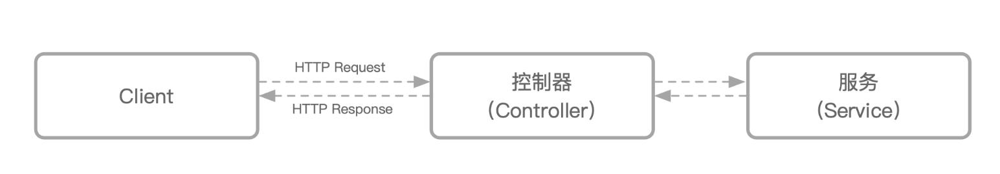

## Service服务

在业务中，只有控制器（Controller）的代码是不够的，一般来说会有一些业务逻辑被抽象到一个特定的逻辑单元中，我们一般称为服务（Service）。

提供这个抽象有以下几个好处：

- 保持 Controller 中的逻辑更加简洁。
- 保持业务逻辑的独立性，抽象出来的 Service 可以被多个 Controller 重复调用。
- 将逻辑和展现分离，更容易编写测试用例。

本项目对service没有做特别封装，除了文件命名及目录位置外规则和midway一致，更多内容请阅读[midway 服务和注入](https://midwayjs.org/docs/service)文档。

## 创建服务
普通的服务就是一个 Class，比如我们之前创建了一个接受 user 请求的 Controller，我们来新增一个处理这些数据的服务。
对于服务的文件，我们一般会存放到 对应模块的`service` 目录中。我们来添加一个 user 服务。
```
├── src
│   ├── app
│   │   ├──admin
│   │   │   ├── controller
│   │   │   │   ├── user.controller.ts
│   │   │   └── service
│   │   │       └── user.service.ts
├── package.json
└── tsconfig.json
```
内容为：
```
// src/app/admin/service/user.service.ts
import { Provide } from '@midwayjs/core';

@Provide()
export class UserService {
  async getUser(id: string) {
    return {
      id,
      name: 'Harry',
      age: 18,
    };
  }
}
```
除了一个 @Provide 装饰器外，整个服务的结构和普通的 Class 一模一样，这样就行了。

## 使用服务
在 Controller 处，我们需要来调用这个服务。传统的代码写法，我们需要初始化这个 Class（new），然后将实例放在需要调用的地方。在 Midway 中，你不需要这么做，只需要编写我们提供的 **"依赖注入"** 的代码写法。

```
//src/app/admin/controller/user.controller.ts
import { Inject, Controller, Get, Provide, Query } from '@midwayjs/core';
import { BaseController } from './base.controller.js';
import { UserService } from '../service/user.service.js';

@Controller('user')
export class UserController extends BaseController {

  @Inject()
  userService: UserService;

  @Get('/info/:id')
  async getUser(@Param('id') id: string) {
    const user = await this.userService.getUser(uid);
   return this.success(user);
  }
}
```
使用服务的过程分为几部分：

- 使用 @Provide 装饰器暴露你的服务
- 在调用的代码处，使用 @Inject 装饰器注入你的服务
- 调用注入服务，执行对应的方法

## 注入行为描述
Midway 的核心 “依赖注入” 容器会自动关联你的控制器（Controller） 和服务（Service），在运行过程中会自动初始化所有的代码，你无需手动初始化这些 Class。

@Provide 装饰器的作用：

- 这个 Class，被依赖注入容器托管，会自动被实例化（new）
- 这个 Class，可以被其他在容器中的 Class 注入
而对应的 @Inject 装饰器，作用为：
- 在依赖注入容器中，找到对应的属性名，并赋值为对应的实例化对象

@Provide 和 @Inject 装饰器是成对出现的，两者通过冒号后的类名进行关联。

事实上，控制器（Controller） 上也有这个装饰器，只是在Midway中，Controller 包含了 Provide 的功能。如果你不确定什么时候可以隐藏，可以都写上。
上边的controller代码等价于
```
@Provide()
@Controller('user')
export class UserController extends BaseController {
```

## 在其余地方使用service
根据上边的介绍，我们可以知道在任何`@Provide`修饰的地方都可以用`@Inject`调用服务，下边我们举个`service`服务互相调用的例子
```
//src/app/admin/service/login.service.ts
import { Inject, Controller, Get, Provide, Query } from '@midwayjs/core';
import { UserService } from '../service/user.service.js';

@Provide()
export class LoginService {

  @Inject()
  userService: UserService;

  async hasUser(id: string) {
    return (await this.userService.getUser(uid))?true:false;
  }
}
```
依赖注入 是 Midway 的核心特性，通过装饰器的轻量特性，让依赖注入变的优雅，从而让开发过程变的便捷有趣。如果想更深一步了解，可以阅读[midway 依赖注入](https://midwayjs.org/docs/container)文档。